# Creating a Project with Maven

## Description

Laboratory 2 of the **Software Development and Lifecycle course (CVDS)**, focused on learning to use the **Maven tool** and **design patterns**.

## **Team Members**  

- **Jesús Alfonso Pinzón Vega**  
  **GitHub Username**: [JAPV-X2612](https://github.com/JAPV-X2612) (Owner)  

- **José David Castillo Rodríguez**  
  **GitHub Username**: [JoseDavidCastillo](https://github.com/JoseDavidCastillo) (Collaborator)  

- **Mayerlly Suárez Correa**  
  **GitHub Username**: [corrllr](https://github.com/corrllr) (Collaborator)  

---

## **Understanding the Maven Tool**  

### **What is its main utility?**  
Apart from being a Java project management tool, Maven's primary utility lies in its ability to manage project dependencies and automate the process of building, testing, and packaging code.  

### **Maven Phases**  

1. **Validate**: Verifies that the project is complete and all necessary information is available.  
2. **Compile**: Converts the source code into binary code.  
3. **Test**: Executes unit tests on the compiled code.  
4. **Package**: Packages the compiled code into a format like JAR or WAR.  
5. **Verify**: Performs additional checks to ensure everything works correctly and meets quality standards.  
6. **Install**: Places the package in the local repository for use as a dependency in other projects.  
7. **Deploy**: Copies the final package to a remote repository to share with other developers.  

### **Build Lifecycle**  

The build lifecycle represents a sequence of phases that manage different aspects of building and maintaining the software.  

1. **Default Lifecycle**  
   Covers the full project build process, including phases like **compile**, **test**, **package**, **install**, and **deploy**.

2. **Clean Lifecycle**  
   Handles cleaning the project directory by removing files generated during earlier phases.  
   - **Phases**: pre-clean, clean, post-clean.  

3. **Site Lifecycle**  
   Responsible for generating project-related documentation.  
   - **Phases**: pre-site, site, post-site.

### **What are Maven plugins used for?**  

Maven plugins are components that perform specific tasks during the build process. Examples include:  

- **maven-compiler-plugin**: Compiles the project's source code.  
- **maven-jar-plugin**: Generates the project's JAR file.  
- **maven-site-plugin**: Creates project documentation.  
- **maven-surefire-plugin**: Runs the project's unit tests.  

### **What is the Maven Central Repository, and what is it used for?**  

The Maven Central Repository is a public repository where Maven retrieves the libraries and dependencies needed for a project. Developers can declare dependencies in the `pom.xml` file, and Maven automatically downloads them, along with their transitive dependencies, from this central repository. This simplifies dependency management and ensures consistent builds across environments.

## Apache Maven

 - Enter `MAVEN_HOME` as the variable name and the path to the Maven directory as the variable value. Click OK to save the new system variable.
 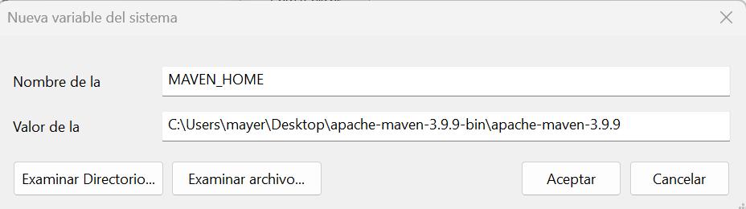

 - Enter `%MAVEN_HOME%\bin` in the new field. Click **OK** to save changes to the Path variable.
 

 - Verify Maven Installation
 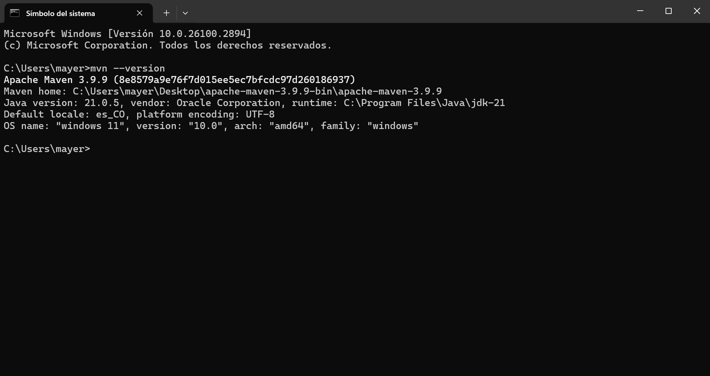

---

 ## 1. CREATE A MAVEN PROJECT

 - **Step 1:** Open a terminal or command line.
 If you're using Windows, open Git Bash, PowerShell, or the command line (cmd).
 If you're using Linux or Mac, open the terminal.
 - **Step 2:** Run the following command
  Copy and paste this command into the terminal and press Enter:
    ```bash
    mvn archetype:generate -DgroupId=edu.eci.cvds -DartifactId=Patterns -Dpackage=edu.eci.cvds.patterns.archetype -DarchetypeArtifactId=maven-archetype-quickstart -DinteractiveMode=false
    ```
    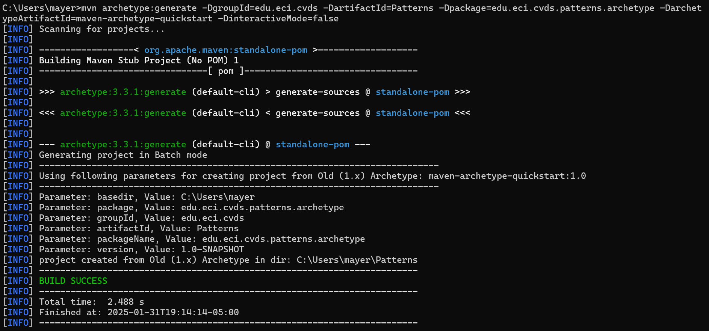
    What does this command do?
    - `mvn archetype:generate`: Use Maven to generate a new project.
    - `DgroupId=edu.eci.cvds`: Defines the project group.
    - `DartifactId=Patterns`: Define the name of the project.
    - `DarchetypeArtifactId=maven-archetype-quickstart`: Use a basic project template.
    - `DinteractiveMode=false`: He does not ask for confirmations, he does it directly.


## 2. VERIFY THAT THE PROJECT WAS CREATED

Once the command finishes, you need to move to the newly created project directory.

- **Step 1:** Move to the project directory
  `cd Patterns`
  

- **Step 2:** View the project structure
 `tree /f`
 You should see a structure similar to this:
 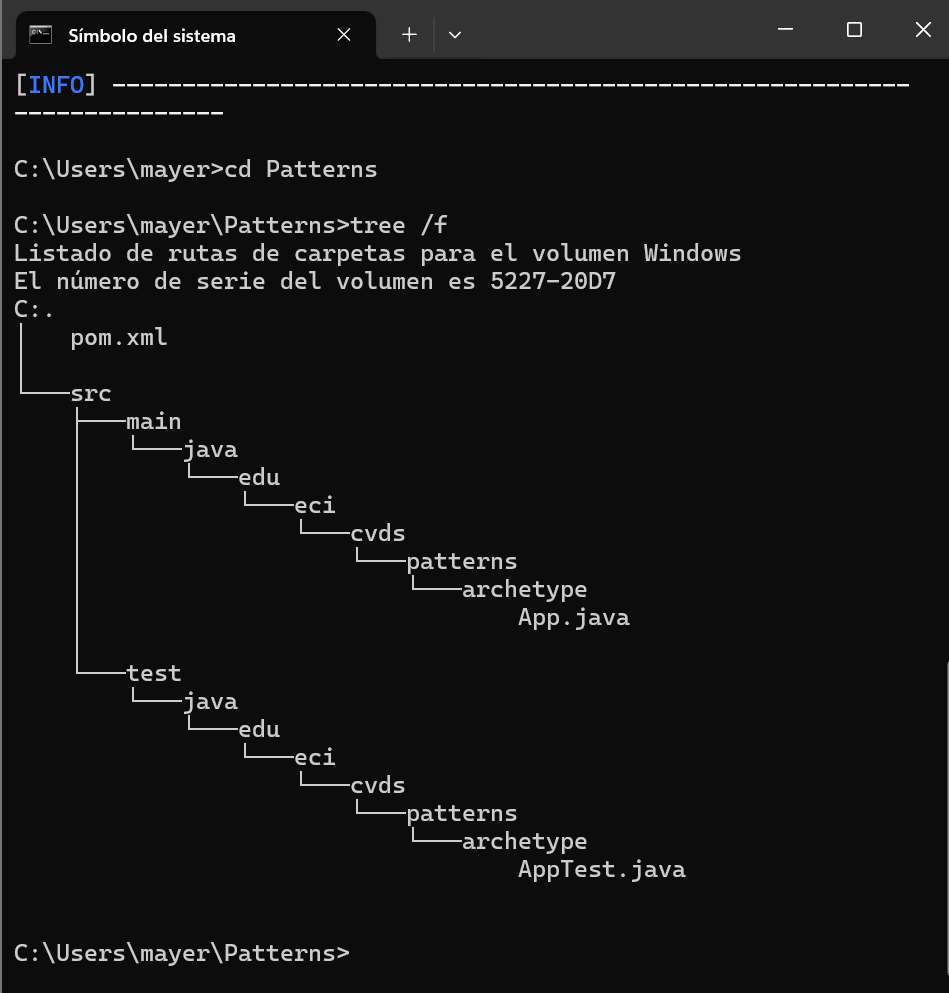


## 3. ADJUST SETTINGS IN THE PROJECT

Maven uses a file called pom.xml to set up the project. Let's make sure it uses Java 8.

- **Step 1:** Open the pom.xml file
 

- **Step 2:** Add the compiler version
  Find the section <dependencies> , and just before it, add this:
  ```bash
  <properties>
    <maven.compiler.target>1.8</maven.compiler.target>
    <maven.compiler.source>1.8</maven.compiler.source>
  </properties>
  ```
  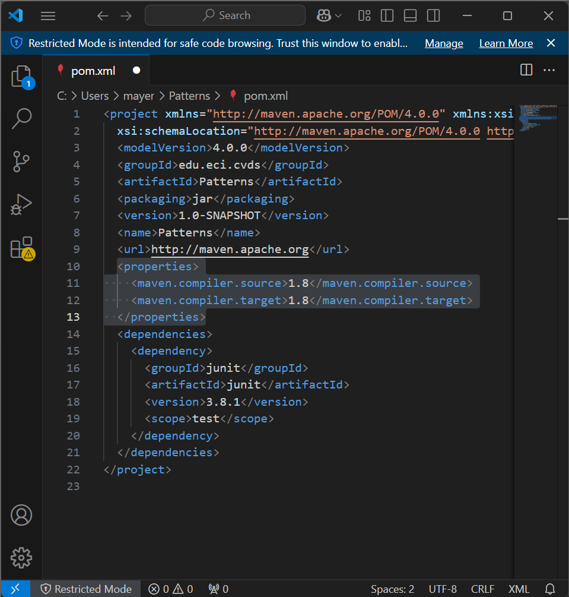

  What does this do?
  He tells Maven to compile the code with Java 8.


## 4. COMPILE AND EXECUTE THE PROJECT

Let's compile the code and run it.

- **Step 1:** Compile
  Run this command:
  `mvn package`
  
  If you need to update dependencies, use:
  `-U package`
  If all goes well, you should see a message like:
  `BUILD SUCCESS`
  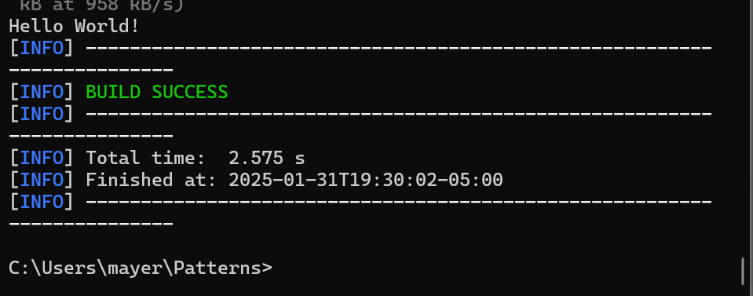
 - **Step 2:** Run 
    ```bash
    mvn exec:java -Dexec.mainClass="edu.eci.cvds.patterns.archetype.App"
    ```
    Expected departure:
    `Hello World!`

## 5. MODIFY THE CUSTOM GREETING

We're going to change the `App.java` class so that it gets a name as a parameter.
  - **Step 1:** Open `App.java`, navigate to `src/main/java/edu/eci/cvds/patterns/archetype/App.java` and open it
  - **Step 2:** Modify the code 
    Change the content of the class `App.java` to this:
    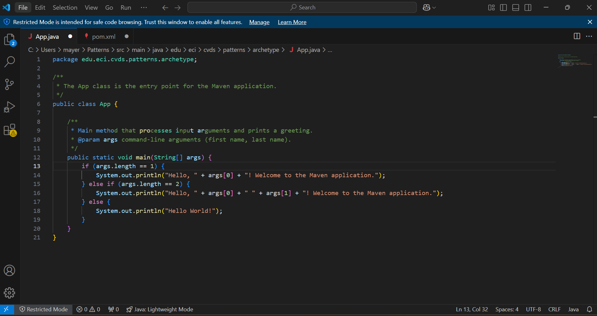


## 6. TRY PERSONALIZED GREETING

  - **Step 1:** Run with a name
    ```bash
    mvn exec:java -Dexec.mainClass="edu.eci.cvds.patterns.archetype.App" -Dexec.args="Mayerlly"
    ```
    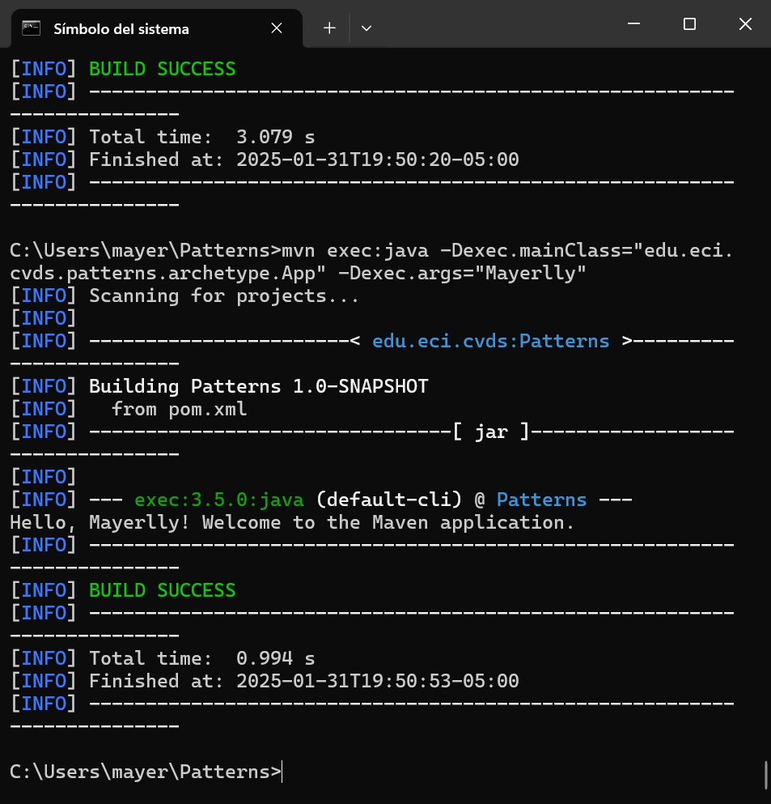
  - **Step 2:** Run with first and last name
    ```bash
    mvn exec:java -Dexec.mainClass="edu.eci.cvds.patterns.archetype.App" -Dexec.args="Mayerlly Suárez"'
    ```
    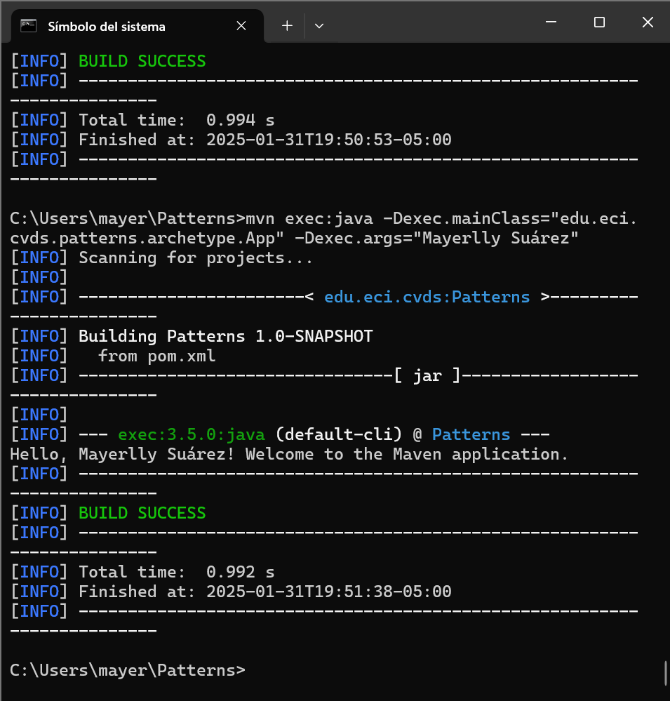


## 7. CREATE THE SKELETON OF THE APPLICATION

  - **Step 1:** Create the packages

    Create the required folders:
      ```bash
      mkdir src/main/java/edu/eci/cvds/patterns/shapes/concrete
      ```
    Then, create the Shape.java file in that location. You can do this manually in an editor like VS Code or Notepad++, or use this command in cmd:
      ```bash
      echo. > src\main\java\edu\eci\cvds\patterns\shapes\Shape.java
      ```
  - **Step 2:** Create the basics of the app

    Create the Shape.java interface
    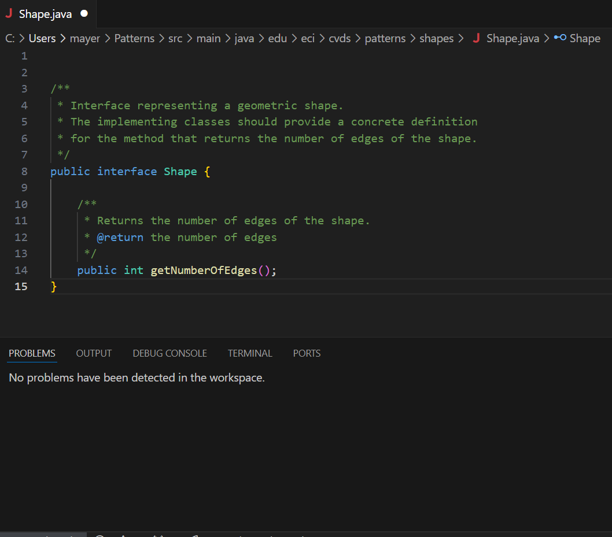
    
    Then create the `RegularTypeShape.java`

    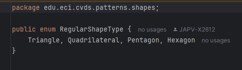

    Now we create the directory concrete in `src/main/java/edu/eci/cvds/patterns/concrete` and within it we will create the classes: `Triangle.java`, `Quadrilateral.java`, `Pentagon.java` and `Hexagon.java` in a similar way of triangle
    
    

    And finally create the `ShapeMain.java`
    

  - **Step 3:** Decide and create the type of factory that the app will use

    There are 3 types of factory that we can use: **simple factory**, **factory method** and **abstract factory**. We decided to use the **simple factory** because the others are more focused on applications with many elements which need an order to be created and these factories offer this through how they are built.
    Otherwise, the simple one only has one factory, which is ideal due to the small amount of elements that we have and not overcomplicating the exercise.

    Now that we have decided wich one we will use, we will create it in the `shapeFactory.java`

    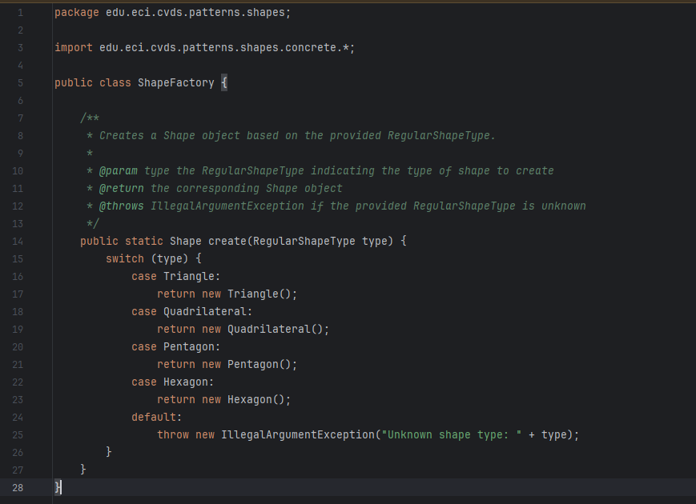

    Finally we will test it with the following parameters:

    - Without Parameters

    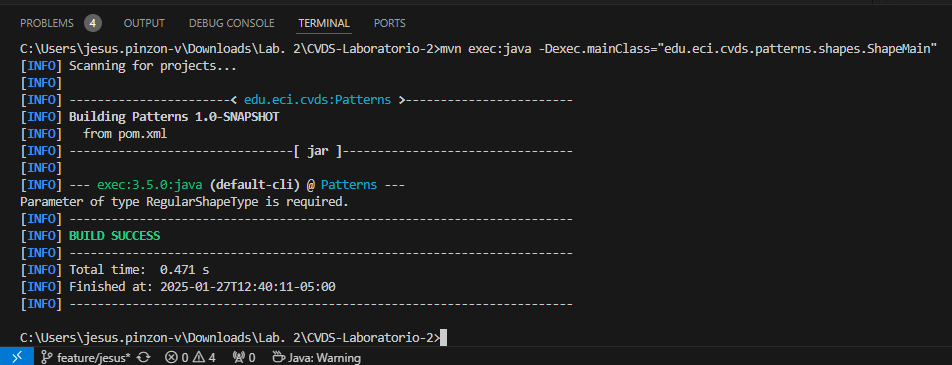

    - qwerty

    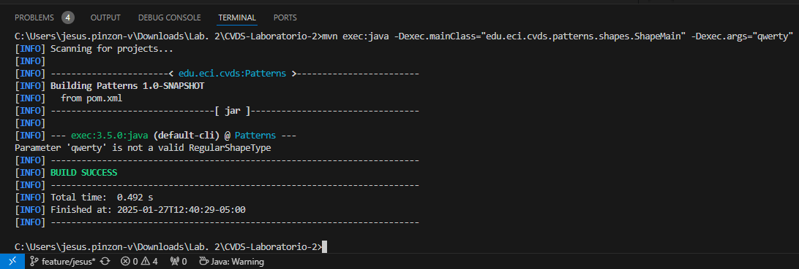

    - pentagon

    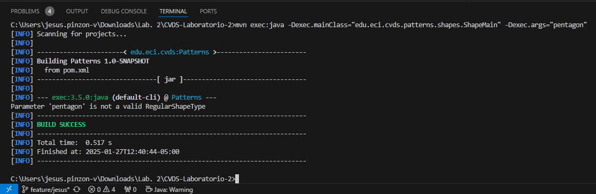

    - Hexagon

    
---


## 8. CREATE AND SET A GITIGNORE FILE

### **What is `.gitignore` for?** 

A `.gitignore` file tells Git which files and directories should be ignored and not tracked in the repository. This helps prevent unnecessary files, such as compiled binaries, temporary files, and system-specific configurations, from being included in version control.  

### **Setting up `.gitignore` for the project**  

To properly configure `.gitignore`, follow these steps:  

1. **Create the `.gitignore` file**  
   In the root directory of the project, create a new file named `.gitignore` wiith PowerShell:  

   ```bash
      New-Item .gitignore
   ```

   

2. **Add the following rules to `.gitignore`**  
   Open the file in a text editor and add the following lines:

    ```bash
      # === Archivos de Compilación ===
      target/
      *.class

      # === Configuración de Maven ===

      Patterns/
      .mvn/
      !**/src/main/**/mvnw
      !**/src/main/**/mvnw.cmd

      # === Configuración de IDE (VS Code) ===
      .vscode/

      # === Archivos de logs ===
      *.log
      *.tmp

      # === Configuración y credenciales ===
      *.env
      *.properties
      application.yml
      application.properties

      # === Dependencias descargadas ===
      *.jar
      *.war
      *.ear

      # === Archivos de sistema ===
      .DS_Store
      Thumbs.db

      # === Archivos de control de versiones innecesarios ===
      *.swp
      *.swo
   ```

   

3. **Verify that `.gitignore` is working**  
   Run the following command to check which files are being ignored:

   ```bash
      git status --ignored
   ```

   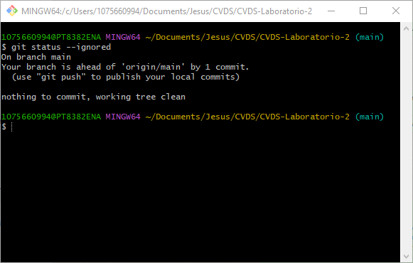

4. **Commit the `.gitignore` file**  
   Finally, add and commit the `.gitignore` file to ensure it is included in version control:

   ```bash
      git add .gitignore
      git commit -m "Added .gitignore to exclude unnecessary files"
   ```

## Conclusions

Thanks to maven and that it automates many aspects of project management, including dependency resolution, compilation, testing, and packaging, making the development process more efficient. Not only that but it also manage the insatallation and usage of multiple librares to use in the project making it really useful and helpful.