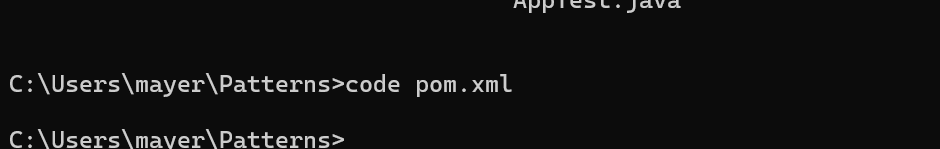
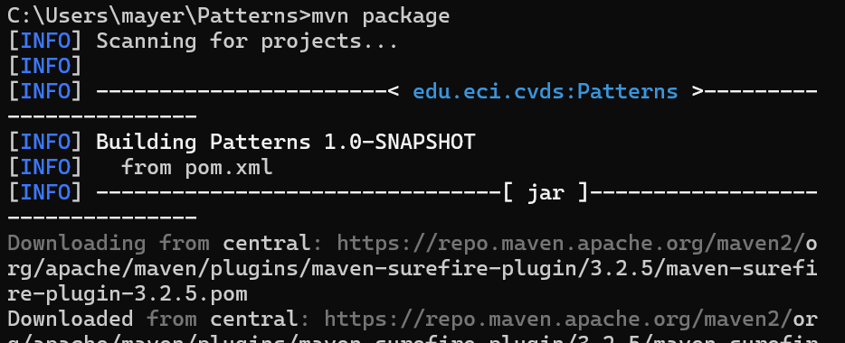

# Creating a Project with Maven

## Description
Laboratory 2 of the **Software Development and Lifecycle course (CVDS)**, focused on learning to use the **Maven tool** and **design patterns**.
---
## **Team Members**  

- **Jesús Alfonso Pinzón Vega**  
  **GitHub Username**: [JAPV-X2612](https://github.com/JAPV-X2612) (Owner)  

- **José David Castillo Rodríguez**  
  **GitHub Username**: [JoseDavidCastillo](https://github.com/JoseDavidCastillo) (Collaborator)  

- **Mayerlly Suárez Correa**  
  **GitHub Username**: [corrllr](https://github.com/corrllr) (Collaborator)  

---

## **Understanding the Maven Tool**  

### **What is its main utility?**  
Apart from being a Java project management tool, Maven's primary utility lies in its ability to manage project dependencies and automate the process of building, testing, and packaging code.  

### **Maven Phases**  

1. **Validate**: Verifies that the project is complete and all necessary information is available.  
2. **Compile**: Converts the source code into binary code.  
3. **Test**: Executes unit tests on the compiled code.  
4. **Package**: Packages the compiled code into a format like JAR or WAR.  
5. **Verify**: Performs additional checks to ensure everything works correctly and meets quality standards.  
6. **Install**: Places the package in the local repository for use as a dependency in other projects.  
7. **Deploy**: Copies the final package to a remote repository to share with other developers.  

### **Build Lifecycle**  

The build lifecycle represents a sequence of phases that manage different aspects of building and maintaining the software.  

1. **Default Lifecycle**  
   Covers the full project build process, including phases like **compile**, **test**, **package**, **install**, and **deploy**.  

2. **Clean Lifecycle**  
   Handles cleaning the project directory by removing files generated during earlier phases.  
   - **Phases**: **pre-clean**, **clean**, **post-clean**.  

3. **Site Lifecycle**  
   Responsible for generating project-related documentation.  
   - **Phases**: **pre-site**, **site**, **post-site**.  

### **What are Maven plugins used for?**  

Maven plugins are components that perform specific tasks during the build process. Examples include:  

- **maven-compiler-plugin**: Compiles the project's source code.  
- **maven-jar-plugin**: Generates the project's JAR file.  
- **maven-site-plugin**: Creates project documentation.  
- **maven-surefire-plugin**: Runs the project's unit tests.  

### **What is the Maven Central Repository, and what is it used for?**  

The Maven Central Repository is a public repository where Maven retrieves the libraries and dependencies needed for a project. Developers can declare dependencies in the `pom.xml` file, and Maven automatically downloads them, along with their transitive dependencies, from this central repository. This simplifies dependency management and ensures consistent builds across environments.
--.

## Apache Maven
 - Enter MAVEN_HOME as the variable name and the path to the Maven directory as the variable value. Click OK to save the new system variable.
 

 - Enter %MAVEN_HOME%\bin in the new field. Click OK to save changes to the Path variable.
 

 - Verify Maven Installation
 
---

 ## 1. CREATE A MAVEN PROJECT
 - Step 1: Open a terminal or command line.
 If you're using Windows, open Git Bash, PowerShell, or the command line (cmd).
 If you're using Linux or Mac, open the terminal.
 - Step 2: Run the following command
  Copy and paste this command into the terminal and press Enter:
    ```bash
    mvn archetype:generate -DgroupId=edu.eci.cvds -DartifactId=Patterns -Dpackage=edu.eci.cvds.patterns.archetype -DarchetypeArtifactId=maven-archetype-quickstart -DinteractiveMode=false
    ```
    
    What does this command do?
    - `mvn archetype:generate`:Use Maven to generate a new project.
    - `DgroupId=edu.eci.cvds`: Defines the project group.
    - `DartifactId=Patterns`: Define the name of the project.
    - `DarchetypeArtifactId=maven-archetype-quickstart`: Use a basic project template.
    - `DinteractiveMode=false`: He does not ask for confirmations, he does it directly.

## 2. VERIFY THAT THE PROJECT WAS CREATED
Once the command finishes, you need to move to the newly created project directory.

- Step 1: Move to the project directory
  `cd Patterns`
  

- Step 2: View the project structure
 `tree /f`
 You should see a structure similar to this:
 

## 3. ADJUST SETTINGS IN THE PROJECT
Maven uses a file called pom.xml to set up the project. Let's make sure it uses Java 8.

- Step 1: Open the pom.xml file
 

- Step 2: Add the compiler version
  Find the section <dependencies> , and just before it, add this:
  ```bash
  <properties>
    <maven.compiler.target>1.8</maven.compiler.target>
    <maven.compiler.source>1.8</maven.compiler.source>
  </properties>
  ```
  

  What does this do?
  He tells Maven to compile the code with Java 8.

## 4. COMPILE AND EXECUTE THE PROJECT
Let's compile the code and run it.

- Step 1: Compile
  Run this command:
  `mvn package`
  
  If you need to update dependencies, use:
  `-U package`
  If all goes well, you should see a message like:
  `BUILD SUCCESS`
  
 - Step 2: Run 
    ```bash
    mvn exec:java -Dexec.mainClass="edu.eci.cvds.patterns.archetype.App"
    ```
    Expected departure:
    `Hello World!`

## 5. MODIFY THE CUSTOM GREETING
We're going to change the `App.java` class so that it gets a name as a parameter.
  - Step 1: Open `App.java`
    Navigate to `src/main/java/edu/eci/cvds/patterns/archetype/App.java` and open it
  - Step 2: Modify the code 
    Change the content of the class App.java to this:
    

## 6. TRY PERSONALIZED GREETING
  - Step 1: Run with a name
    ```bash
    mvn exec:java -Dexec.mainClass="edu.eci.cvds.patterns.archetype.App" -Dexec.args="Mayerlly"
    ```
    
  - Step 2: Run with first and last name
    ```bash
    mvn exec:java -Dexec.mainClass="edu.eci.cvds.patterns.archetype.App" -Dexec.args="Mayerlly Suárez"'
    ```
    

## 7. CREATE THE SKELETON OF THE APPLICATION
  - Step 1: Create the packages

    Create the required folders:
      ```bash
      mkdir src/main/java/edu/eci/cvds/patterns/shapes/concrete
      ```
    Then, create the Shape.java file in that location. You can do this manually in an editor like VS Code or Notepad++, or use this command in cmd:
      ```bash
      echo. > src\main\java\edu\eci\cvds\patterns\shapes\Shape.java
      ```
  - Step 2: Create the Shape.java interface
    


---


```bash
# Example for Java
java -version


mvn exec:java -Dexec.mainClass="edu.eci.cvds.patterns.shapes.ShapeMain" -Dexec.args="Hexagon"

```